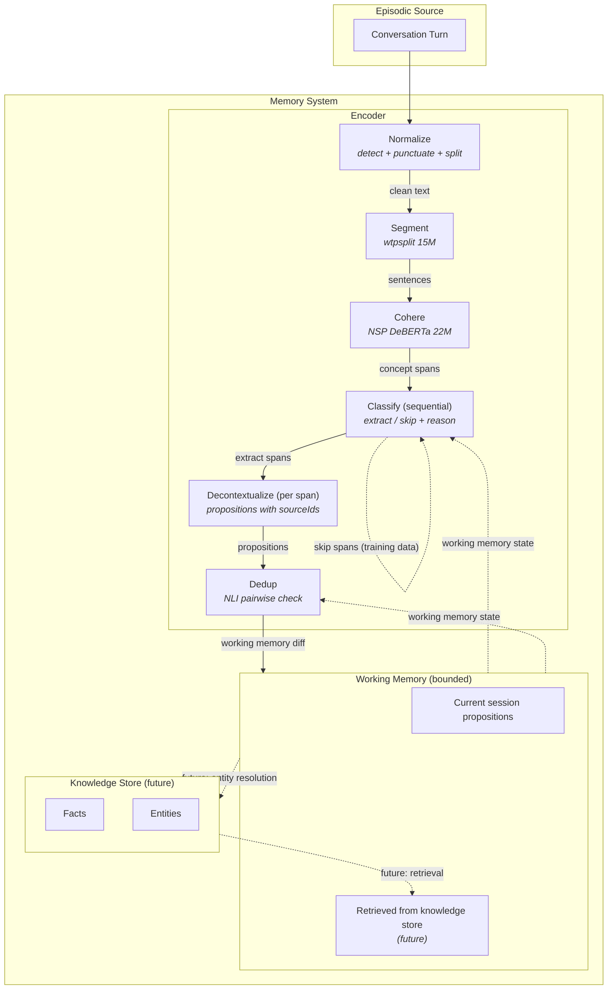
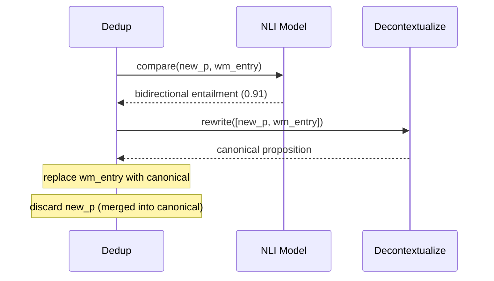
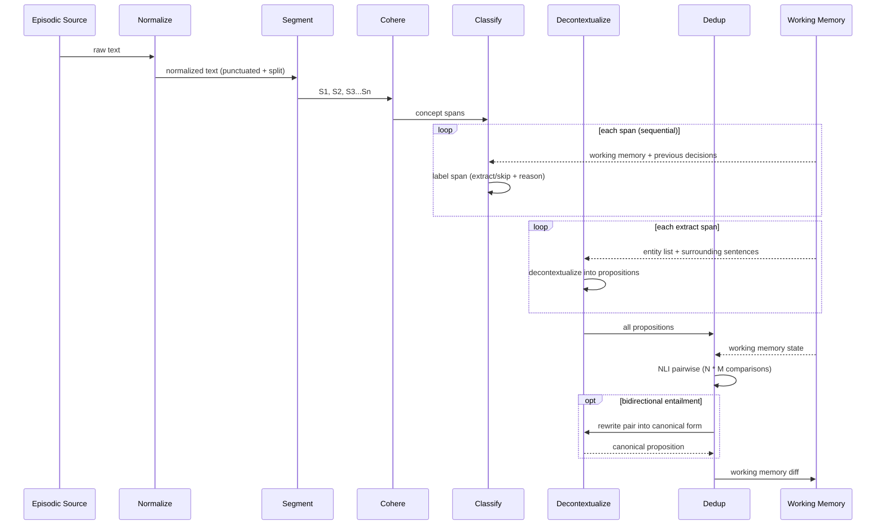

# Memory System Architecture

## Glossary

| Term | Definition |
|------|-----------|
| **Memory System** | The complete module. Encoder + working memory + knowledge store + entity resolution + consolidation. Input: episodic sources. Output: structured, entity-linked, temporally-versioned knowledge. |
| **Encoder** | The pipeline: normalize → segment → cohere → classify → decontextualize → dedup. Input: episodic source + working memory state. Output: working memory diff. Scope ends at working memory. |
| **Episodic Source** | Raw input to the encoder: a conversation turn, transcript segment, article, or any temporal unit of text. |
| **Sentence** | Atomic text unit from segmentation. Verbatim from source. Identified by `S1`, `S2`, etc. Speaker metadata carried from the episodic source, not produced by the segmenter. |
| **Concept Span** | One or more adjacent sentences grouped by discourse coherence. The unit that the classifier labels. |
| **Proposition** | Self-contained, decontextualized knowledge unit. Encoder output. Contains text + sourceIds + scope + type. No pronouns, no inline provenance. Lives in working memory. |
| **Fact** | A proposition after entity resolution and persistence. Proposition + entity links (subject/object) + temporal metadata (validFrom, status) + sourceEpisodeIds. Lives in the knowledge store. Not built yet. |
| **Working Memory** | Bounded set of propositions relevant to the current processing context. Versioned via event-sourced diffs. The encoder reads from and writes to working memory. |
| **Knowledge Store** | All persisted facts with entity links and temporal metadata. Long-term memory. Append-only with soft delete (supersession, not deletion). Not built yet. |
| **Entity** | A named, persistent concept that appears across multiple facts. Constrained taxonomy: Person, Project, Technology, Organization, Concept. Not built yet. |
| **Entity Resolution** | Links entity mentions in propositions to existing entities in the knowledge store. Three-stage: embedding, text, LLM/NLI. The boundary where propositions become facts. Not built yet. |
| **Working Memory Diff** | The output of one encoder run. `{added: [propositions], archived: [ids], superseded: [{old, new}], rewritten: [{old, new}]}`. Applied to working memory. |
| **Supersession** | Temporal invalidation. When a new proposition contradicts an existing one in working memory, the old one gets `status: superseded`. Old proposition preserved. |
| **Consolidation** | Periodic background dedup of the knowledge store, grouped by entity. Catches redundancies between propositions that were never co-resident in working memory. Not built yet. |

## Scope: What We Are Building Now

The encoder + working memory. Everything from episodic source to working memory diff.

**Not building yet:** entity resolution, knowledge store, fact persistence, entity model, consolidation. These are documented here for architectural context but are future work.

## System Overview



## Encoder: Input, Output

The encoder is a pure function:

```
Input:  Episodic Source + Working Memory State
Output: Working Memory Diff {added, archived, superseded, rewritten}
```

The encoder's scope ends at the working memory diff. It does not do entity resolution. It does not write to the knowledge store. It produces propositions and updates working memory.

## Encoder Stages

### 1. Normalize (punctuate + split)
Three sub-steps. Source-agnostic: handles any input regardless of whether it came from Deepgram, another STT, exported LLM conversations, or pasted text.

**1a. Detect punctuation quality**
- **Method**: ratio of punctuation marks (`. , ? !`) to word count. Well-punctuated English: ~1 period per 15-20 words, ~1 comma per 8-12 words. If ratio is far below threshold, text needs punctuation.
- **No model needed**: arithmetic on character counts. <1ms.
- **Why not a simple "contains periods?" check**: STT can produce text with some punctuation but missing most of it. Ratio catches partial punctuation.

**1b. Punctuate (conditional, runs only when 1a detects low punctuation)**
- **Model**: `1-800-BAD-CODE/xlm-roberta_punctuation_fullstop_truecase` (560M params, ONNX, 47 languages)
- **Performance**: 92.4 F1 on periods, 78.8 on commas, 80.5 on question marks. Also does truecasing.
- **Why gated, not unconditional**: punctuation models strip existing punctuation before re-predicting. They are not idempotent. Running on already-punctuated text introduces spurious commas (0.75% false positive rate) and changes correct punctuation. Source: oliverguhr/fullstop model documentation.
- **SLM from day one**: pre-trained, no training needed
- **Inference**: one model call per turn (when gate passes)

**1c. Split overlong sentences**
- **Method**: after punctuation, check sentence word counts. Any sentence over threshold (40-50 words) gets split at natural clause boundaries.
- **Rules-based**: split at coordinating conjunctions (", and", ", but", ", so", ", or") when preceded by a subject-verb clause. No model needed.
- **Why**: STT produces run-on compound sentences. Punctuation model may correctly add commas but not periods. This catches "I went to the store, and then I picked up groceries, and then I came home, and started cooking" and splits it.
- **Inference**: regex + word count. <1ms.

### 2. Segment
- **Model**: wtpsplit (15M params, 3ms, ONNX)
- **Input**: punctuated text
- **Output**: `[{id: "S1", text: "..."}, {id: "S2", text: "..."}, ...]`
- **No speaker field**: speaker metadata comes from the episodic source, not the segmenter
- **SLM from day one**: pre-trained, no training needed
- **Inference**: one model call per turn

### 3. Cohere
- **Method**: Next Sentence Prediction (NSP) discourse coherence
- **Model**: DeBERTa 22M (~3ms per pair)
- **Input**: adjacent sentence pairs from segment output
- **Output**: coherence score per pair. Drop below threshold = group boundary. Produces concept spans.
- **Why NSP, not embeddings**: "I decided to use ObjectBox" + "Because it supports all six platforms" have low embedding similarity but high discourse coherence. NSP directly answers "is this a continuation of the previous thought?" Embeddings answer "are these about the same topic?" - weaker, less precise.
- **SLM from day one**: pre-trained NSP head, no training needed
- **Inference**: one model call per adjacent pair. N sentences = N-1 inferences.

### 4. Classify (extract / skip) - sequential
- **Model**: Groq LLM initially, CRF or SetFit/DeBERTa classifier (22M) after training data
- **Input per span**: one concept span + working memory state + previous span decisions
- **Output per span**: label (`extract` | `skip` with reason + confidence)
- **Sequential, not batch**: each span classified one at a time. Previous span + label passed as context to the next. Research (EMNLP 2024, LLM-SSC) shows +1.5 F1 improvement over independent classification when labels have contextual dependencies. For extract/skip, dependencies are real: if you just extracted "ObjectBox persistence," the next mention is likely `already_known`.
- **Why sequential also helps SLM replacement**: CRF-style structured prediction (where adjacent labels are jointly optimized) adds +0.35 F1 over independent softmax. Sequential LLM classification is a reasonable approximation of CRF without training a custom layer. 2B models (Gemma-2b + LoRA) achieved 0.907 Micro F1 with sequential context. 8B handles this trivially.
- **Skip reasons**: ephemeral, trivial, generic, already_known, unresolved. Reasons are training data for the SLM replacement.
- **Full coverage**: every sentence in exactly one span, every span labeled
- **Inference**: one LLM call per span (sequential). N spans = N calls. Context per call: current span + working memory + last 5-10 span decisions (~50-100 tokens each).
- **No Claude models**: Groq inference only. Respect inference budget.

### 5. Decontextualize - per span
- **Model**: Groq LLM initially. T5-3B fine-tuned is the minimum viable SLM (SARI 0.5183). Sub-1B cannot do this task (Choi et al. 2021).
- **Input per span**:
  1. The target span text
  2. 2-3 surrounding sentences (from the same turn)
  3. Entity mention list from working memory (known entities the model can resolve references to)
- **Output per span**: self-contained propositions with sourceIds + scope + type
- **Key operation**: coreference resolution - "it" to "ObjectBox", "this approach" to "dedicated transcript tab"
- **Why per-span, not batch**: enables SLM replacement. Per-span keeps context small (~200 tokens). Batch requires full turn context which exceeds small model capacity.
- **Why entity list matters**: instead of the model inferring "it" = "ObjectBox" from conversation history, you hand it `Known entities: ObjectBox, Flutter, DeBERTa`. The model picks the right one. This dramatically reduces context needed and makes the task tractable for T5-3B. 76% of coreference links fall within 500 words; 90% of pronoun references resolve within 5 entity mentions.
- **Hybrid SLM path**: use sub-1B NLI model on-device for coreference detection (flag which spans need rewriting). Only spans with unresolved references hit the LLM. Clean spans pass through unchanged.
- **No "Because" clauses**: provenance stored as sourceIds, not inline text
- **One fact per proposition**: two ideas = two propositions
- **Scope**: session (this conversation) | project (named project) | life (identity-level)
- **Type**: learning (discovered fact) | project (decision/requirement) | exploration (investigated option)
- **Also called by dedup**: when bidirectional entailment detected, dedup routes the pair back here for canonical rewrite.
- **Inference**: one LLM call per extract span. Context per call: span + surrounding sentences + entity list (~200 tokens).
- **No Claude models**: Groq inference only.

### 6. Dedup (NLI entailment against working memory)
- **Model**: NLI cross-encoder (22M)
- **Input**: new propositions + working memory state
- **Output**: working memory diff
- **Multi-step process**:
  1. For each new proposition, run NLI against every working memory entry (N * M inferences)
  2. **No match** (all entailment scores below threshold): add to working memory
  3. **Bidirectional entailment** (same meaning, different words): route both propositions back to decontextualize for canonical rewrite. The rewrite replaces both.
  4. **Contradiction** (high contradiction score): supersede the old proposition
- **SLM from day one**: zero-shot NLI, no training needed
- **Inference**: N propositions * M working memory entries * 3ms each. Plus optional decontextualize callbacks for rewrites.

## Dedup Detail: Rewrite Loop

When dedup detects bidirectional entailment, it triggers a rewrite cycle. This is the only place where the encoder loops back on itself.



## Trace Structure (per-turn logging)

Every turn produces a complete trace through all stages. Each stage logs input, output, model, and latency. All intermediate results preserved for inspection and golden data generation.

```json
{
  "turnId": "conv_3475558a_turn_0",
  "episodicSource": {
    "text": "raw turn text",
    "speaker": "user",
    "episodeId": "conv_3475558a"
  },
  "workingMemoryBefore": ["p_01", "p_02"],

  "stages": {
    "normalize": {
      "input": "raw turn text",
      "punctuationRatio": 0.02,
      "punctuationNeeded": true,
      "punctuateModel": "xlm-roberta-punctuation-560M",
      "punctuateLatencyMs": 15,
      "splitCount": 1,
      "splitDetails": [{"original": "long compound sentence, and then...", "splitAt": 23}],
      "output": "normalized turn text",
      "totalLatencyMs": 16
    },

    "segment": {
      "input": "punctuated turn text",
      "output": [
        {"id": "S1", "text": "first sentence."},
        {"id": "S2", "text": "second sentence."}
      ],
      "model": "wtpsplit-15M",
      "latencyMs": 3
    },

    "cohere": {
      "input": ["S1", "S2", "S3", "S4"],
      "pairScores": [
        {"pair": ["S1", "S2"], "coherenceScore": 0.92, "boundary": false},
        {"pair": ["S2", "S3"], "coherenceScore": 0.34, "boundary": true},
        {"pair": ["S3", "S4"], "coherenceScore": 0.88, "boundary": false}
      ],
      "output": [
        {"spanId": "span_0", "sentenceIds": ["S1", "S2"]},
        {"spanId": "span_1", "sentenceIds": ["S3", "S4"]}
      ],
      "model": "deberta-nsp-22M",
      "threshold": 0.5,
      "latencyMs": 9
    },

    "classify": {
      "sequential": true,
      "decisions": [
        {
          "spanId": "span_0",
          "input": {"span": "span_0", "previousDecisions": []},
          "label": "extract",
          "confidence": 0.94,
          "model": "groq/llama-3.3-70b-versatile",
          "latencyMs": 600
        },
        {
          "spanId": "span_1",
          "input": {"span": "span_1", "previousDecisions": [{"spanId": "span_0", "label": "extract"}]},
          "label": "skip",
          "reason": "ephemeral",
          "confidence": 0.87,
          "model": "groq/llama-3.3-70b-versatile",
          "latencyMs": 550
        }
      ],
      "totalLatencyMs": 1150
    },

    "decontextualize": {
      "perSpan": true,
      "spans": [
        {
          "spanId": "span_0",
          "input": {
            "spanText": "first sentence. second sentence.",
            "surroundingSentences": ["S3", "S4"],
            "entityList": ["ObjectBox", "Flutter", "Everything Stack"]
          },
          "output": [
            {
              "propositionId": "p_03",
              "text": "Self-contained proposition text.",
              "sourceIds": ["S1", "S2"],
              "scope": "project",
              "type": "learning"
            }
          ],
          "model": "groq/llama-3.3-70b-versatile",
          "latencyMs": 800
        }
      ],
      "totalLatencyMs": 800
    },

    "dedup": {
      "comparisons": [
        {
          "newPropositionId": "p_03",
          "comparedTo": "p_01",
          "entailmentScore": 0.12,
          "contradictionScore": 0.03,
          "decision": "no_match"
        },
        {
          "newPropositionId": "p_03",
          "comparedTo": "p_02",
          "entailmentScore": 0.91,
          "contradictionScore": 0.01,
          "decision": "bidirectional_entailment",
          "rewriteTriggered": true,
          "rewriteInput": ["p_03", "p_02"],
          "rewriteOutput": {
            "propositionId": "p_04",
            "text": "Canonical merged proposition.",
            "sourceIds": ["S1", "S2", "S5"],
            "scope": "project",
            "type": "learning"
          },
          "rewriteModel": "groq/llama-3.3-70b-versatile",
          "rewriteLatencyMs": 600
        }
      ],
      "actions": [
        {"propositionId": "p_02", "action": "superseded_by_rewrite", "replacedBy": "p_04"},
        {"propositionId": "p_03", "action": "merged_into_rewrite", "replacedBy": "p_04"},
        {"propositionId": "p_04", "action": "add", "source": "dedup_rewrite"}
      ],
      "model": "deberta-nli-22M",
      "latencyMs": 6
    }
  },

  "workingMemoryDiff": {
    "added": [{"propositionId": "p_04", "source": "dedup_rewrite"}],
    "archived": [],
    "superseded": [{"old": "p_02", "replacedBy": "p_04", "reason": "dedup_merge"}],
    "rewritten": [{"old": "p_03", "mergedInto": "p_04"}]
  },

  "workingMemoryAfter": ["p_01", "p_04"]
}
```

Key properties:
- Every stage has explicit `input`, `output`, `model`, `latencyMs`
- Confidence scores where applicable (classify, dedup)
- Coherence pair scores for boundary inspection
- Dedup logs every pairwise comparison with NLI scores
- Dedup rewrite loops are fully traced (input pair, output canonical, model used)
- Working memory state before and after
- All IDs trace back to source sentences
- No Claude models anywhere. Groq for LLM stages.

## Data Flow Per Turn



## Working Memory Versioning

Each change to working memory is a diff event:

```json
{"action": "add", "propositionId": "p_42", "timestamp": "...", "source": "encoder"}
{"action": "archive", "propositionId": "p_12", "timestamp": "...", "reason": "context_pressure"}
{"action": "supersede", "propositionId": "p_08", "supersededBy": "p_42", "timestamp": "..."}
{"action": "rewrite", "oldPropositionId": "p_03", "newPropositionId": "p_43", "timestamp": "...", "reason": "dedup_merge"}
```

Working memory state at any point = replay diffs from empty. The diff sequence is the version history.

## Progressive Intelligence

```
Phase 1 (now):     Groq LLM does classify + decontextualize. SLMs do the rest.
Phase 2 (golden):  Human review corrects per-stage outputs (training data)
Phase 3 (SLM):     On-device models take over per-stage
Phase 4 (active):  Low-confidence routes to Groq, rest stays on-device

Stage          | Phase 1          | Phase 3 Target             | SLM from day one?
---------------|------------------|----------------------------|------------------
Normalize      | xlm-roberta (gated) + rules | xlm-roberta + rules (already) | Yes
Segment        | wtpsplit         | wtpsplit (already)         | Yes
Cohere         | NSP/DeBERTa      | NSP/DeBERTa (already)      | Yes
Classify       | Groq LLM (seq)   | CRF or SetFit/DeBERTa 22M | No (needs examples)
Decontextualize| Groq LLM (span)  | T5-3B fine-tuned (minimum) | No (generative, sub-1B fails)
Dedup          | NLI/DeBERTa      | NLI/DeBERTa (already)      | Yes (zero-shot)
```

### Inference Budget Policy

- SLM stages (normalize, segment, cohere, dedup): on-device, zero API cost
- LLM stages (classify, decontextualize): Groq only. No Claude, no GPT-4.
- Max model size for Groq: smallest model that passes quality threshold
- Dedup rewrite callbacks to decontextualize: counted as LLM calls in budget

### Golden Data Purpose

Golden data exists for the encoder only. Its boundary is: episodic source in, working memory diff out. Nothing beyond working memory needs to be in the golden dataset.

| Golden Data Slice | Trains/Evaluates |
|-------------------|-----------------|
| sentences[] | Segmenter output validation |
| pairScores[] | Coherence grouper boundary accuracy |
| spans[] labels (extract/skip + reason) | Classifier |
| propositions[] text | Decontextualizer quality |
| propositions[] scope + type | Scope/type classification |
| dedup comparisons[] | NLI threshold tuning |

The schema is additive. New stages add fields without breaking existing data. Each stage trains independently.

---

## Future Work (not in current build)

### Entity Resolution
- Links propositions to entities in the knowledge store
- Three-stage: embedding search, BM25 text match, LLM/NLI resolution
- The boundary where propositions become facts
- Runs per-turn, async, after encoder updates working memory

### Knowledge Store
- All persisted facts with entity links and temporal metadata
- Append-only with supersession (soft delete)
- Periodic consolidation by entity (background NLI dedup)

### Temporal Invalidation
When entity resolution detects a contradiction between a new proposition and an existing fact (NLI: entailment of negation between facts sharing entity pairs), the older fact is marked `status: superseded`. Old fact preserved with temporal validity window - never deleted.

**Why not a full belief network?** We evaluated Truth Maintenance Systems (JTMS/ATMS). TMS was designed for expert systems where facts are derived through formal inference. Personal knowledge facts are observed (stated in conversation), not derived. The overhead of inter-fact dependency graphs provides no benefit for episodic input. Neither Graphiti/Zep nor Mem0 implements fact-to-fact relationships beyond supersession. Documented in DECISIONS.md.

### Entity Model (constrained taxonomy)
Person, Project, Technology, Organization, Concept. NOT entities: attributes ("version 3.x"), actions ("decided to use"), ephemeral references ("this approach" - resolved during decontextualization).

### Research: Proposition to Fact Timing
Every production memory system processes per-turn, not per-session. Graphiti: per-message, 4-5 LLM calls. Mem0: per-message-pair. Letta: agent-initiated. LangMem: hot-path or debounced. Nobody defers entity resolution. Consolidation is the only deferred operation. Sources: arXiv 2501.13956, arXiv 2504.19413, arXiv 2504.13171.

### Why Other Systems Use So Many LLMs
Graphiti, Mem0, and others don't decompose the problem. They treat extraction as one monolithic LLM task (4-5 calls per message). This architecture decomposes into stages with clear boundaries. Punctuate, segment, cohere, and dedup are SLMs from day one. Only classify and decontextualize need LLMs initially, both with SLM replacement paths. Result: 1-2 LLM calls per turn trending toward zero.
